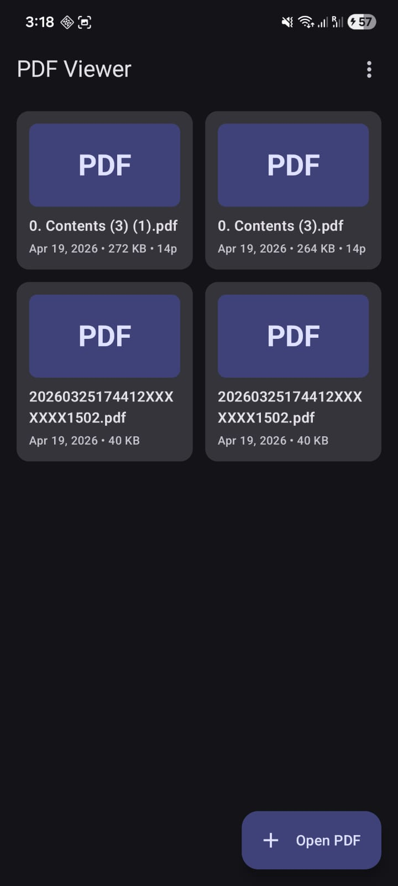
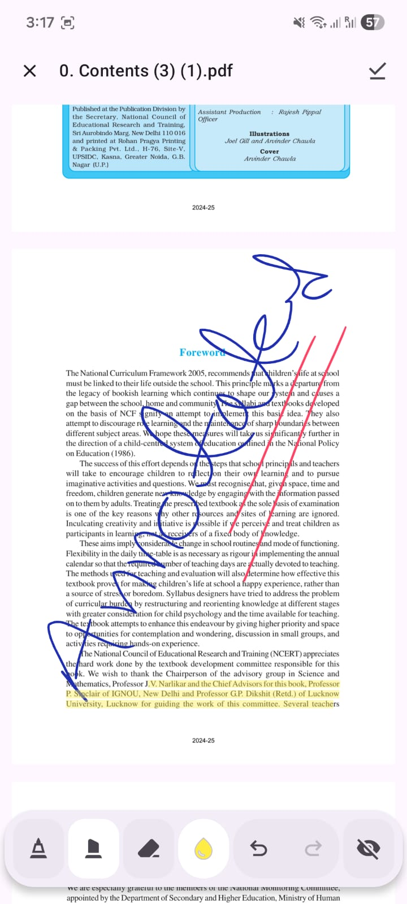
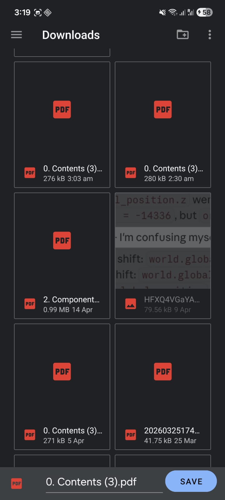

# Android PDF Viewer (Jetpack Compose + Views)

A modern **Android PDF Viewer** project with annotation support, search, dark mode, fullscreen reading, orientation controls, and flexible host-app integration.

This repository includes:
- a demo app module (`app`) that opens PDFs and tracks recent files
- a reusable PDF module (`pdf`) you can integrate into your own Android app

If you are searching for **Android PDF viewer with annotations**, **Jetpack Compose PDF viewer**, or a **customizable PDF activity**, this project is built for that use case.

## Screenshots

> Placeholder images (add your screenshots later)





## Features

- Open and render PDF files
- Annotate PDFs with save flow support
- Save to original file and **Save As** to user-selected filesystem location
- Optional Download action
- Night mode (dark/inverted reading)
- Text search in document
- Fullscreen reading mode
- Orientation toggle from menu
- Page persistence hooks
- Callback-based extension points for ads, analytics, and menu customization
- Compose-based and classic View-based activity implementations

## Project Structure

```text
PDFViewer/
  app/   -> Demo application module
  pdf/   -> Reusable PDF viewer module/library
```

## Quick Start

### 1) Clone

```bash
git clone <your-repo-url>
cd PDFViewer
```

### 2) Open in Android Studio

Open the root folder and let Gradle sync.

### 3) Run the demo app

Select the `app` module run configuration and launch on device/emulator.

## Use the PDF Module

If you want to integrate the reusable PDF module in your own app, go to:

- [`pdf/README.md`](pdf/README.md)
- [`docs/pdf-management-scanner-implementation.md`](docs/pdf-management-scanner-implementation.md) — PDF Management + Scanner Implementation Plan
- [`docs/project-status.md`](docs/project-status.md) — Current Project Status and Next Steps
- [`docs/compose-state-guide.md`](docs/compose-state-guide.md) — Compose State Management Guide
- [`docs/compose-side-effects-guide.md`](docs/compose-side-effects-guide.md) — Compose Side Effects Guide
- [`docs/compose-components-guide.md`](docs/compose-components-guide.md) — Compose Component Design Guide
- [`docs/compose-compositionlocals-guide.md`](docs/compose-compositionlocals-guide.md) — Compose CompositionLocals Guide
- [`docs/compose-design-translation-guide.md`](docs/compose-design-translation-guide.md) — Compose Design Translation Guide
- [`docs/compose-motion-guide.md`](docs/compose-motion-guide.md) — Compose Motion Guide
- [`docs/compose-navigation-guide.md`](docs/compose-navigation-guide.md) — Compose Navigation Guide
- [`docs/compose-performance-guide.md`](docs/compose-performance-guide.md) — Compose Performance Guide

It includes:
- integration steps
- configuration options
- Compose and non-Compose examples
- save/annotation behavior notes

## SEO Keywords

Android PDF Viewer, PDF annotation Android, Jetpack Compose PDF, Android PDF reader library, PDF save as Android, Kotlin PDF viewer, EditablePdfViewerFragment integration.

## License

Add your license text or a `LICENSE` file here.
